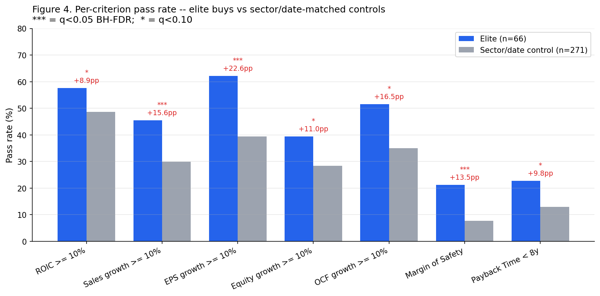

# quantitative-trading

A research project that asks: **can a modern LLM automate the qualitative parts of value investing well enough that a fully-automated Rule One strategy actually beats the market?**

The agent implements [Phil Town's Rule One](https://www.ruleoneinvesting.com/) framework — Big 5 numbers, the 4 Ms (Meaning, Moat, Management, Margin of Safety) and Sticker Price — using LLM-driven qualitative analysis on SEC filings combined with code-driven quantitative analysis on as-filed financials.

## What's in here

- **`src/quantitative_trading/agents/rule_one/`** — the value-investing agent. Big 5 ratios, Sticker Price / Margin of Safety, Payback Time, and an LLM-driven 4Ms analyzer that reads the 10-K and returns a structured pass/fail with rationale.
- **`src/quantitative_trading/data/`** — point-in-time data layer. SEC EDGAR client (filings as filed, not as later restated), yfinance wrapper with strict PIT cutoff, historical S&P 500 constituents.
- **`src/quantitative_trading/dataset/`** — historical dataset builder. For each `(ticker, trade_date)` pair, runs the agent and computes a forward 5-year CAGR label.
- **`src/quantitative_trading/backtest/`** — backtest engine and ablation framework. Compares full-Rule-One vs. quant-only vs. random-qualitative variants on classification metrics and portfolio simulation.
- **`src/quantitative_trading/investors/`** — value-investor 13F audit toolkit. Downloads SEC 13F-HR filings for a curated list of value-oriented institutional managers (Munger/DJCO, Pabrai, Li Lu, Akre, Spier, Nygren/Harris, Russo, Berkowitz, Weitz, Greenberg), detects first-ever new positions, resolves CUSIPs, and scores each buy against the Rule One bar at the time of purchase. See **[`docs/REPORT.md`](docs/REPORT.md)** for the full academic report and **[`notebooks/reports/investor_criteria_audit.ipynb`](notebooks/reports/investor_criteria_audit.ipynb)** for interactive exploration.

## Headline finding from the value-investor audit

> Of 66 evaluable new positions opened by 10 value-oriented 13F filers in 2017–2024, **0** satisfied Phil Town's strict 7-criteria bar. But all 7 criteria show positive elite-vs-control premium — 3 are statistically significant after BH-FDR correction (EPS growth +22.6 pp, MoS +13.5 pp, Sales growth +15.6 pp). Within elite picks, criterion-pass count does NOT predict realized return (KM log-rank p=0.58). **Top-tier value investors use the criteria as soft preferences, not hard pass/fail gates.** Town's bar is over-strict relative to actual elite practice.

See [`docs/REPORT.md`](docs/REPORT.md) for the full design, methodology (CMH + BH-FDR + Kaplan-Meier), results, and limitations (§13 caveats).



## Quick start

```bash
# 1. Install
uv venv
source .venv/bin/activate
uv pip install -e ".[notebook,dev]"

# 2. Set credentials
cp .env.example .env
# edit .env: ANTHROPIC_API_KEY and SEC_USER_AGENT (must be a real monitored email)

# 3. Run tests to verify the data layer is PIT-correct
pytest tests/

# 4. Build a single-stock evaluation as a smoke test
python -m quantitative_trading.agents.rule_one.agent --ticker AAPL --date 2015-06-30

# 5. Build the full historical dataset (this is the expensive step)
python scripts/build_dataset.py --start 2012Q1 --end 2021Q1 --universe sp500

# 6. Run the backtest with ablation
python scripts/run_backtest.py

# 7. (Optional) Run the value-investor audit pipeline
#    (~12 min cold cache, ~5 min warm; produces data/investors/*.csv)
python -m scripts.build_investor_purchases
python -m scripts.run_investor_audit          # prints all section 7 statistical analyses
python -m scripts.generate_audit_figures      # writes 8 PNGs to docs/figures/
```

## Methodology

### The agent

For a given `(ticker, T)`, the agent recommends BUY iff **all** of:

| Pillar | Check | Computed by |
|---|---|---|
| Meaning | Business is understandable, durable demand | LLM (10-K Item 1) |
| Moat | Durable competitive advantage | LLM (10-K Item 1, 7) cross-checked vs. ROIC stability |
| Management | Trustworthy, owner-oriented capital allocation | LLM (10-K Item 7, proxy) |
| Big 5 #1 | ROIC ≥ 10% (10y avg, holding/rising) | code |
| Big 5 #2 | Sales growth ≥ 10% (10y CAGR) | code |
| Big 5 #3 | EPS growth ≥ 10% (10y CAGR) | code |
| Big 5 #4 | Equity growth ≥ 10% (10y CAGR) | code |
| Big 5 #5 | Operating cash flow growth ≥ 10% (10y CAGR) | code |
| Margin of Safety | Price ≤ 50% × Sticker Price | code |
| Payback Time | < 8 years | code |

The 3 Tools (MACD / Stochastic / MA crossovers) are deferred — they're about timing, not the value decision the LLM is meant to test.

### The dataset

- **Universe**: historical S&P 500 constituents at each trade date (no survivorship bias).
- **Trade dates**: quarterly, 2012-Q1 → 2021-Q1, evaluated 45 days after each fiscal quarter end (when 10-Q is reliably available).
- **Label**: forward 5-year price CAGR ≥ 15% (Phil Town's actual target). Total return, split/dividend adjusted. Delisted stocks get their realized return.
- **Volume**: ~500 tickers × 37 quarters ≈ 18.5k rows. ~5,000 unique LLM calls (cached by `(ticker, fiscal_year)`).

### The backtest

Three agent variants on the same grid:
- **A — Full Rule One**: Big 5 + Sticker + Payback + LLM 4Ms.
- **B — Quant only**: Big 5 + Sticker + Payback (no LLM). Tests whether qualitative adds anything.
- **C — Quant + random qualitative**: Negative control to show LLM is doing real work.

Reported metrics: precision/recall/F1, portfolio CAGR vs. SPY, Sharpe, max drawdown, calibration plots.

## Critical risks the design addresses

- **Look-ahead via restated financials** — EDGAR XBRL data is keyed on filing accession + filing date, not period end. Tested against known restatements.
- **Survivorship bias** — historical index membership snapshots, not today's list.
- **LLM training-data leakage** — ablation includes a ticker-masked variant.
- **Cost** — aggressive caching at all layers; LLM calls keyed by fiscal year, not quarter.

## Project layout

```
src/quantitative_trading/
  data/               # PIT EDGAR + prices + universe + cache
  agents/rule_one/    # the agent (big five, sticker, payback, LLM 4Ms, decision)
  dataset/            # historical (ticker, date) -> features + label builder
  backtest/           # engine, metrics, reports
notebooks/            # exploration, validation, results
tests/                # pytest suite, focused on PIT correctness
scripts/              # CLI entry points
data/                 # local cache (gitignored)
```

## Status

Active research project. Not investment advice.
