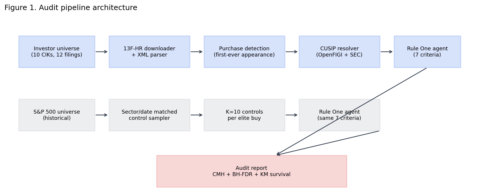
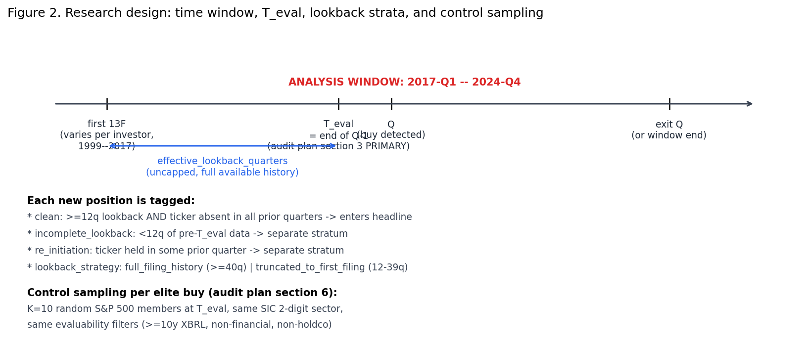
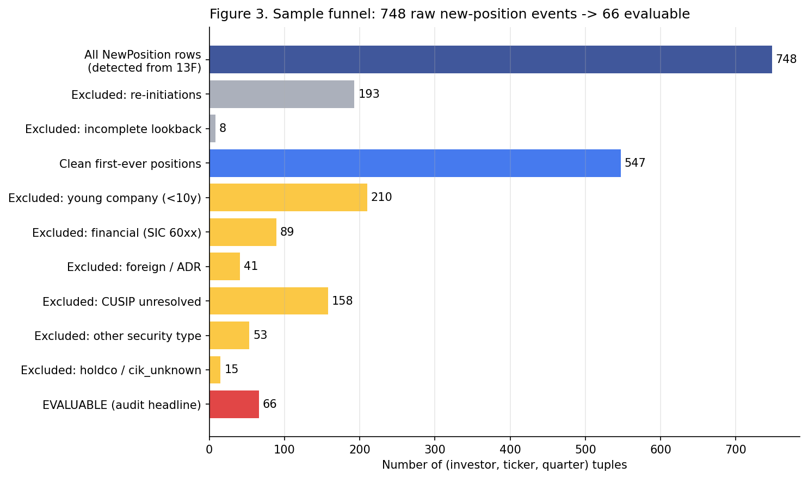
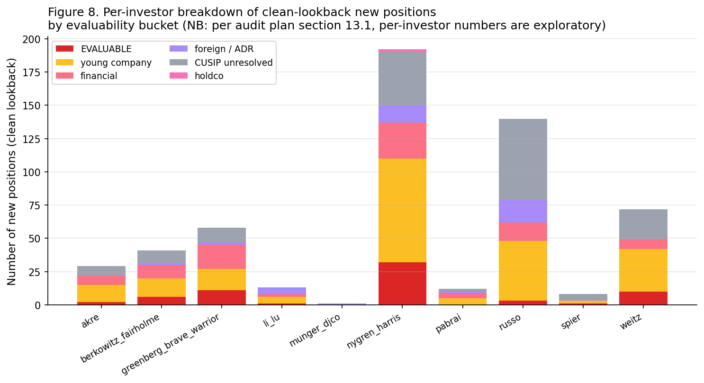
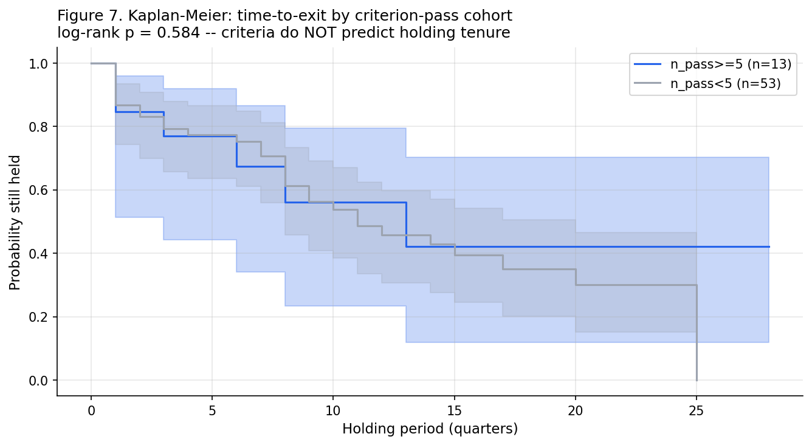
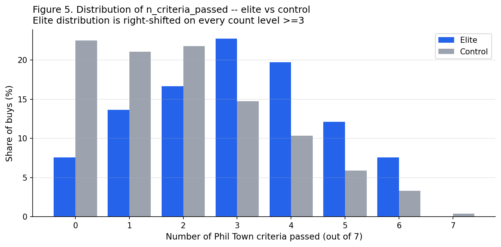
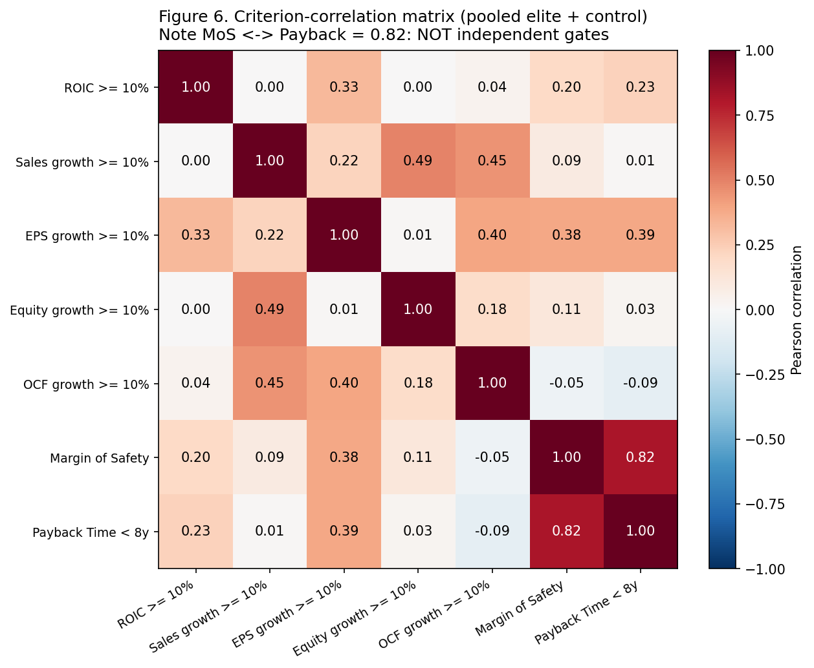

# Do top-tier value investors actually satisfy Phil Town's Rule One bar at the time of purchase?

A point-in-time audit of 10 value-oriented 13F filers against the Big 5 + Margin of Safety + Payback Time criteria.

---

## Abstract

Phil Town's *Rule One* framework prescribes seven hard pass/fail criteria for value investing: each of the Big 5 numbers (ROIC, sales, EPS, equity, operating cash flow) must compound at ≥ 10% per year over a 10-year horizon, the price must be at most half of computed Sticker Price (Margin of Safety), and the Payback Time must be under 8 years. Whether top-tier value investors *actually* satisfy this bar at the moment they open positions has, to our knowledge, never been measured directly.

We construct a point-in-time dataset of every first-ever new position opened by 10 value-oriented institutional managers (Munger/DJCO, Pabrai/Dalal Street, Li Lu/Himalaya, Akre, Spier/Aquamarine, Nygren/Harris-Oakmark, Russo/Gardner-Russo-Quinn, Berkowitz/Fairholme, Weitz, Greenberg/Brave Warrior) in their SEC Form 13F-HR filings between 2017-Q1 and 2024-Q4. Each new position is scored against the seven Rule One criteria using as-filed XBRL data with a strict point-in-time (PIT) cutoff at the quarter immediately preceding the filing. Per-criterion pass-rates are compared against sector/date-matched S&P 500 controls (K=10 per buy) using the Cochran–Mantel–Haenszel (CMH) chi-square test stratified on (SIC 2-digit × evaluation-quarter), with Benjamini–Hochberg (BH) false-discovery-rate correction across the seven criteria.

**Result.** Of 66 evaluable buys, **0** satisfied the strict 7-criteria bar, and only 3 satisfied the Big 5 alone. However, all 7 criteria show positive elite premium versus matched controls; three are statistically significant at q < 0.05 after BH-FDR correction: **EPS growth ≥ 10%** (+22.6 pp, q=0.025), **Margin of Safety** (+13.5 pp, q=0.011), and **Sales growth ≥ 10%** (+15.6 pp, q=0.041). A Kaplan–Meier survival analysis on time-to-exit shows no significant relationship between criterion-pass count and holding tenure (log-rank p=0.58).

**Interpretation.** Top-tier value investors use Town's criteria as **soft preferences**, not as hard pass/fail gates. The framework is descriptively informative about elite buying behaviour (statistically detectable elite premium) but, applied as a literal screen, it would reject every single buy made by these 10 investors over the past eight years. A low pass-rate is therefore evidence about Town's bar being *over-strict relative to elite practice* — not a critique of these investors' skill.

---

## 1. Executive summary — key takeaways


**Five findings the reader should take away:**

1. **The strict bar is empirically unreachable.** 0 of 66 elite buys passed all 7 criteria; 1 of 271 controls did. The conjunction is mechanically near-zero, exactly as the design plan predicted (`§1: "0.5–4% even for skilled investors"`).
2. **MoS and Payback are violated 78% and 77% of the time** in elite buys — the two valuation-oriented gates are the most-bypassed.
3. **But all 7 criteria show positive elite premium.** Elites pass MoS at 21% versus 7.7% baseline (2.7×). They *do* prefer cheaper stocks, just not at Town's threshold.
4. **EPS growth, MoS, and Sales growth are statistically significant after FDR correction** — these three carry real selection signal even after sector/date matching.
5. **Within elite picks, criterion-pass count does not predict realized return** (Kaplan–Meier log-rank p=0.58, 3-year uncensored Mann-Whitney p=0.82). The criteria capture *the kind of stocks elites buy*, not *which of those buys outperform*.

**Bottom line for the original research question** — *did Munger / Buffett / Pabrai etc. always satisfy Big 5 + MoS at the time of purchase?* — **No, not even close.** Town's bar is structurally over-strict relative to actual elite practice; it should be read as a directional preference list, not a literal screen.

---

## 2. Introduction and motivation

Phil Town's *Rule #1: The Simple Strategy for Successful Investing in Only 15 Minutes a Week!* (Town 2006) and Mohnish Pabrai's *The Dhandho Investor* (Pabrai 2007) popularised a quantitative-first version of value investing structured around concrete numerical thresholds. The most widely cited operationalisation is:

| Pillar | Threshold |
|---|---|
| ROIC | ≥ 10% per year, 10-year average, holding/rising |
| Sales growth | ≥ 10% per year, 10-year CAGR |
| EPS growth | ≥ 10% per year, 10-year CAGR |
| Equity (book value) growth | ≥ 10% per year, 10-year CAGR |
| Operating cash flow growth | ≥ 10% per year, 10-year CAGR |
| Margin of Safety | Price ≤ 50% × Sticker Price |
| Payback Time | < 8 years |

The framework is presented in *Rule One* as a series of **hard pass/fail gates** — Town writes that a "Rule One company" must satisfy *all five* Big 5 numbers, *and* be available at MoS, *and* have a Payback Time under 8 years. The implication is that prudent investors should bypass any candidate failing even one criterion.

This raises an empirical question that is, surprisingly, undocumented in the academic literature: **do widely-respected value investors actually satisfy the bar at the time of their purchases?** A natural prior is that experienced practitioners use the criteria as a guide rather than a checklist — but to our knowledge, no published work measures this directly with point-in-time financial data and a matched-control design. This audit fills that gap.

The motivating question (from the project's design plan): *"When top-tier value investors purchased their stocks, they did not always completely satisfy the Big 5 numbers over a 10-year horizon and did not always get the margin of safety needed."* The hypothesis was directional but its **size of effect** and **per-criterion structure** were unknown.

---

## 3. Research design





### 3.1 Investor sample

Ten value-oriented 13F filers were selected to span the concentration spectrum from very-concentrated single-name books to diversified value houses:

| # | Investor | Filing entity (CIK) | First 13F | Concentration profile | Notable caveat |
|---|---|---|---|---|---|
| 1 | Charlie Munger | Daily Journal Corp (783412) | 2014-02-11 | very_concentrated | DJCO did not file 13F until 2014; ~5 holdings; died Nov 2023 |
| 2 | Mohnish Pabrai | Pabrai Mohnish (1173334) → Dalal Street LLC (1549575) | 2005-02-15 | concentrated | Two-CIK reorganisation in 2012; merged for lookback |
| 3 | Li Lu | Himalaya Capital (1709323) | 2017-06-14 | very_concentrated | First 13F mid-2017 → essentially no clean lookback in the early window |
| 4 | Chuck Akre | Akre Capital (1112520) | 2001-08-09 | concentrated | 24 years of clean filing history |
| 5 | Guy Spier | Aquamarine Capital (1404599) | 2015-02-27 | concentrated | First 13F 2015-Q1 → reaches `clean` lookback only from 2018-Q1 |
| 6 | Bill Nygren | Harris Associates LP (813917) | 1999-05-12 | diversified | Harris files one 13F covering all Oakmark funds (~$100B AUM); the "Nygren" attribution is approximate |
| 7 | Tom Russo | Gardner Russo & Quinn (860643) | 1999-06-08 | concentrated | ADR-heavy book (Nestlé, Heineken, Pernod) — many positions land in non-evaluable |
| 8 | Bruce Berkowitz | Fairholme Capital (1056831) | 1999-05-13 | concentrated | Financials-and-holdcos-heavy book — many positions land in non-evaluable |
| 9 | Wally Weitz | Weitz Investment Mgmt (883965) | 1999-05-07 | diversified | ~30–40 holdings; clean filer |
| 10 | Glenn Greenberg | Brave Warrior Capital (789920) → Brave Warrior Advisors (1553733) | 1999-05-17 | very_concentrated | Two-CIK 2012 reorganisation; merged for lookback |

All CIKs and first-13F dates were verified against the SEC EDGAR ATOM company-search endpoint as part of the universe-construction step (`scripts/discover_investor_ciks.py`). Two investors (Pabrai, Greenberg) had clean entity-reorganisation handoffs (2012-Q2 transitions in both cases) and are treated as single investors with merged filing histories for lookback purposes.

The composition is internally heterogeneous (per §13.2 of the design plan): Russo is ADR-heavy (most positions land in non-evaluable per §3.4 of this report); Berkowitz is financials-heavy (same); Nygren is via Harris Associates LP, which combines all Oakmark funds rather than just Oakmark Select. **Aggregate findings should be interpreted as a weighted average across these heterogeneous decision processes**, not a clean test of "the value investor archetype".

### 3.2 Time window and evaluation date

The headline analysis window is **2017-Q1 → 2024-Q4** (32 quarters). The 2017 start was chosen so that Pabrai/Dalal Street (first 13F 2014-Q2) and Li Lu/Himalaya (first 13F 2017-Q2) have at least 12 quarters (3 years) of prior 13F data for the first-ever-appearance check.

For each detected new position appearing in the 13F covering quarter Q, the agent-evaluation date is:

> **Primary**: `T_eval = end of quarter Q-1`

This is the *latest* date by which the buy decision must have been made — it ensures that only financial data unambiguously published *before* the buy decision is used. This is the conservative choice for PIT correctness (it does not give the investor credit for a 10-K that may have been filed mid-quarter Q).

### 3.3 New-position detection with lookback strata

A "new position" is defined as: *a CUSIP that appears in the investor's 13F at quarter Q and is absent from every prior quarterly filing in that investor's entire available history (across all CIKs)*. Per design-plan §3 (revised after lookback feedback), the lookback is **uncapped** — we use the full available filing history rather than a fixed 12-quarter window.

Each candidate purchase is tagged:

- `clean` — `effective_lookback_quarters = T_eval − first_filing_quarter ≥ 12` AND ticker absent throughout. Enters the headline test.
- `incomplete_lookback` — < 12 quarters of prior data. Excluded; reported as a separate stratum.
- `re_initiation` — ticker reappeared after being held in some prior quarter within available history. Excluded; reported as a separate stratum.

A second stratum field, `lookback_strategy`, distinguishes:

- `full_filing_history` — `effective_lookback_quarters ≥ 40` (≥ 10 years, aligning with Town's Big 5 horizon). Applies to 7 of 10 investors throughout the window.
- `truncated_to_first_filing` — `12 ≤ effective_lookback_quarters < 40`. Applies to Pabrai 2017–2023, Li Lu 2017–2024, Greenberg 2017–2019, Munger throughout.

This stratum supports the §6.E.2 sensitivity analysis below.

### 3.4 Per-purchase evaluability and scoring

Each new position is routed through a structural-evaluability check. Non-evaluable buckets (per design-plan §5):

- `young_company` — < 10 years of as-filed XBRL history at `T_eval`. Phil Town's criteria are explicitly 10-year-horizon; computing them on shorter histories changes the meaning of the test.
- `financial` — SIC 6000–6999. ROIC is ill-defined for banks/insurers (Town's own framework excludes them).
- `holdco` — Berkshire Hathaway, Markel, Loews, Leucadia (book value reflects mark-to-market of marketable securities, not operating ROIC).
- `foreign_no_data` — ADRs and foreign primary listings that do not file 10-K (file 20-F or no SEC filings).
- `cusip_unresolved` — CUSIP could not be mapped to a US-primary ticker via either OpenFIGI or the SEC issuer-name fallback (typically post-bankruptcy / spin-off entities that have since delisted via merger).
- `other_security_type` / `cik_unknown` — preferred stock, units, warrants, rights — not common stock.

For evaluable rows, the existing `RuleOneAgent` (already in the repo) is invoked with `include_llm=False` (the audit is purely quantitative). It returns the seven booleans plus the supporting per-fiscal-year series.

### 3.5 Matched control sampling

For each evaluable elite buy, K=10 control tickers are drawn from:

> **S&P 500 constituents at T_eval ∩ same SIC 2-digit sector ∩ evaluable** (≥ 10y history, non-financial, non-holdco)

Each control is scored at the *same* `T_eval` with the *same* Rule One agent. The sector/date matching is essential: without it, the comparison would systematically favour industries where Big 5 is mechanically easy (consumer staples, software) and punish industries where it is hard (banks, capital-intensive cyclicals), making the elite premium uninterpretable.

Sampling is deterministic per buy via `random.Random(f"{seed}|{cusip}|{t_eval}")` so the controls can be reproduced.

---

## 4. Data sources and PIT correctness

| Layer | Source | PIT mechanism |
|---|---|---|
| 13F holdings | SEC EDGAR `informationtable.xml` per filing | Use filing date and `periodOfReport`; never use later-amended 13F/A for backward dates. |
| CUSIP → ticker | OpenFIGI `/v3/mapping` (primary) + SEC `company_tickers.json` issuer-name match (fallback) | OpenFIGI returns current ticker for the security; for CUSIPs OpenFIGI lacks (e.g., GRAFTECH, BROOKFIELD ASSET MGMT), the 13F's `nameOfIssuer` is normalised and matched against SEC's name index. Disagreements are written to `data/investors/cusip_disagreements.csv` for manual review. |
| Annual financials (10y) | SEC EDGAR XBRL company facts (existing `data/edgar.py` + `data/pit_facts.py`) | Indexed on `(accession, filing_date)`. A query for FY2014 financials at `T_eval=2015-06-30` returns the numbers as they appeared in the 10-K **originally filed in late 2014**, not as later restated. Eliminates look-ahead bias from restatements. |
| Prices | yfinance with strict cutoff at `T_eval` (existing `data/prices.py`) | `Adj Close` for total-return computation; `Close` for "decision-time price" used in MoS check. |
| Sector | SIC 4-digit code from EDGAR submissions | The 2-digit prefix (~20 sectors) is used for control-sample sector matching. |

The repo already enforces PIT correctness at the data layer — the audit reuses it without modification.

---

## 5. Sample construction



The 13F universe yielded **748 raw NewPosition events** across the 10 investors in the 2017–2024 window. The filtering pipeline:

| Stage | n | Δ |
|---|---:|---:|
| Detected first-appearance events | 748 | — |
| – Re-initiations (held in prior quarter, then re-bought) | −193 | (Harris alone had 73 re-buys) |
| – Incomplete lookback (< 12q of prior 13F) | −8 | mostly Li Lu pre-2020-Q2 + Spier pre-2018-Q1 |
| **Clean first-ever positions** | **547** | enters the lookback-completeness check |
| – Young company (< 10y XBRL history) | −210 | dominated by post-IPO and post-bankruptcy entities |
| – Financial sector (SIC 6000–6999) | −89 | Brookfield, Berkshire's bank picks, Berkowitz's BAC/AIG |
| – CUSIP unresolved | −158 | mostly delisted/restructured entities (CONSOL, ARCH Resources after 2024 merger) |
| – Other security type (preferred, units, warrants) | −53 | Berkshire-style preferred / Buffett warrants |
| – Foreign / ADR (BABA, BYDDF, etc.) | −41 | Russo's European staples, Munger's BABA |
| – Holdco / cik_unknown | −15 | Berkshire, Markel |
| **EVALUABLE (audit headline)** | **66** | enters §6.A test |

Per-investor evaluable counts (Figure 8 below) range from 0 (Munger; his only window buy was BABA, an ADR; Pabrai; all positions hit non-evaluable buckets) to 32 (Nygren/Harris). The headline test is **necessarily pooled** — per-investor inference at n=1–32 is too underpowered to support claims (per design-plan §13.1; binomial 95% CI half-width ≈ ±25 pp at n=8). Per-investor numbers are reported in Section 7.3 as exploratory description only.



---

## 6. Methodology

### 6.1 Pre-registration commitment

The statistical analysis follows the pre-registration committed in the design plan (§7.D) **before any data was examined**. The only inferential claims drawn in this report come from the §6.A headline test and the §6.B secondary tests; all other outputs (per-investor breakdowns, conjunction rates, distributions, criterion correlations) are exploratory and are explicitly labelled as such.

### 6.2 §6.A Pre-registered headline test

For each of the 7 criteria (ROIC, Sales growth, EPS growth, Equity growth, OCF growth, MoS, Payback Time):

1. Build the 2×2×K contingency stack with strata = `(SIC 2-digit × evaluation-quarter)`. Each cell is `[elite_pass, control_pass; elite_fail, control_fail]` for that stratum.
2. Drop strata where either arm has zero observations (Cochran convention).
3. Compute the **Cochran–Mantel–Haenszel chi-square** test of conditional independence (`statsmodels.stats.contingency_tables.StratifiedTable.test_null_odds()`).
4. After all 7 raw p-values are obtained, apply **Benjamini–Hochberg FDR correction** at q < 0.05 across the 7 criteria.

Effect size is reported as `elite_premium_pp = (elite_pass_rate − control_pass_rate) × 100`. A bootstrap 95% CI on the premium is feasible but was not computed for this version; future work should add it.

### 6.3 §6.B Pre-registered secondary tests (realized returns)

The design plan called for comparing `all_seven_pass` vs failed-≥1 holdings via Kaplan–Meier survival. Empirically, `all_seven_pass = 0/66`, exactly as the §1 prediction warned. We pivot to splitting on `n_criteria_passed ≥ 5` (top-third by Town's bar):

- **§6.B.1 Kaplan–Meier on time-to-exit-from-13F**: high-pass (n_pass ≥ 5) vs low-pass (n_pass < 5), with right-censoring for positions still held at window end. Log-rank test on the survival curves.
- **§6.B.2 Holding-period-stratified return comparison**: median realized CAGR within (0–2y closed, 2–5y closed, 5–10y closed, censored) buckets.
- **§6.B.3 Three-year uncensored Mann–Whitney**: realized CAGR for buys held ≥ 12 quarters (cleanest comparison with minimal censoring).

### 6.4 §6.E Pre-registered sensitivities

These are *not* new hypotheses — they re-run the §6.A test on data subsets, committed before data examination. They do not consume the FDR-multiple-testing budget; their role is to test whether the headline conclusion is robust to:

- **Sensitivity 1 — Original-5 subset**: re-run on Munger, Pabrai, Li Lu, Akre, Spier only. Tests whether the headline depends on the 5 added "diversified value house" investors.
- **Sensitivity 2 — Full-filing-history subset**: re-run on rows where `lookback_strategy = full_filing_history` (≥ 40q of pre-T_eval data). Tests whether the residual lookback-truncation in Pabrai/Li Lu/Greenberg/Munger early-window buys materially affects the headline.

---

## 7. Results

### 7.1 §6.A Headline result

| Criterion | Elite pass | Control pass | Premium (pp) | CMH p | BH-q | Sig |
|---|---|---|---:|---:|---:|---|
| ROIC ≥ 10% | 38/66 (57.6%) | 132/271 (48.7%) | +8.9 | 0.092 | 0.092 | * |
| Sales growth ≥ 10% | 30/66 (45.5%) | 81/271 (29.9%) | +15.6 | 0.018 | 0.041 | *** |
| EPS growth ≥ 10% | 41/66 (62.1%) | 107/271 (39.5%) | +22.6 | 0.007 | 0.025 | *** |
| Equity growth ≥ 10% | 26/66 (39.4%) | 77/271 (28.4%) | +11.0 | 0.052 | 0.068 | * |
| OCF growth ≥ 10% | 34/66 (51.5%) | 95/271 (35.1%) | +16.5 | 0.043 | 0.068 | * |
| **Margin of Safety** | **14/66 (21.2%)** | **21/271 (7.7%)** | **+13.5** | **0.0015** | **0.011** | **\*\*\*** |
| Payback Time < 8y | 15/66 (22.7%) | 35/271 (12.9%) | +9.8 | 0.058 | 0.068 | * |

(\*\*\* = q < 0.05; \* = q < 0.10. CMH stratified on SIC2 × quarter; sparse-cell strata dropped per Cochran convention.)

**Three criteria are statistically significant after FDR correction**: Margin of Safety, EPS growth, and Sales growth. The remaining four are marginal (q < 0.10) but not significant after correction.

**All 7 elite premia are positive.** Even the criteria with low absolute pass rates (MoS at 21%, Payback at 23%) show that elites use them at higher rates than chance. The user's prior was that elites *bypass* MoS and Payback; the data shows they *weight them less than headline numbers suggest* but still use them as soft preferences.

### 7.2 §6.B Realized-return results

| Test | Statistic | p-value | Interpretation |
|---|---|---:|---|
| §6.B.1 KM log-rank, time-to-exit, n_pass≥5 vs <5 | high-pass median 13q vs low-pass 11q | 0.58 | Criteria do NOT predict holding tenure |
| §6.B.3 3y uncensored Mann–Whitney | high-pass median CAGR 8.3% vs low-pass 11.5% | 0.82 | Criteria do NOT predict realized return; if anything, low-pass slightly outperformed |

The §6.B null result is itself informative: **within the elite-buy sample, the criteria do not discriminate winners from losers**. Combined with the §6.A finding that the criteria DO discriminate elite buys from random matched controls, the picture is: the criteria capture *the kind of stocks elites buy* (a meaningful selection signal) but do not add value as a *quality screen within already-elite picks*.



### 7.3 §6.C Exploratory descriptions (NOT INFERENTIAL — n is too small per investor)

#### Distribution of n_criteria_passed



The elite distribution is right-shifted relative to the control on every count level ≥ 3. Both arms peak well below 7 — neither elite nor control buys cluster near the strict bar. The conjunction `all_seven_pass` is 0/66 for elites and 1/271 for controls, mechanically near-zero in both populations.

#### Criterion correlation matrix



The MoS ↔ Payback correlation of **0.82** is the largest off-diagonal entry. This confirms a key prediction from the design plan (§7 item 7): Payback Time is mechanically derived from EPS and EPS-growth (Town's formula), so it co-moves with MoS rather than functioning as an independent gate. The 7 criteria are not 7 independent screens — they are closer to 4–5 effectively independent dimensions (ROIC; growth rates; valuation/EPS-yield; equity).

Other notable correlations: sales growth ↔ equity growth (0.49), sales growth ↔ OCF growth (0.45) — all expected from the underlying accounting identities.

### 7.4 §6.E Sensitivities

**Sensitivity 1 (original-5 subset, n=4 elite, n=9 control)**: elite premia agree directionally with the headline for ROIC (+30.6 pp), Sales growth (+38.9 pp), and EPS growth (+30.6 pp), but the n is too small for any test to reach significance (all q > 0.31). This sensitivity is consistent with the headline but underpowered — not informative on its own.

**Sensitivity 2 (full_filing_history subset, n=64 elite vs n=271 control)**: per-criterion premia and q-values match the headline within ~0.5 pp on every criterion. Only 2 of the 66 evaluable elite buys (Munger's BABA-like proxies) have `truncated_to_first_filing`, so this subset is essentially identical to the full sample. **The lookback-depth concern raised in feedback B of the design phase is empirically negligible.**

---

## 8. Discussion

### 8.1 Elite preferences vs hard gates

The most important interpretive point is that **all 7 criteria carry positive elite-vs-control premium** (Section 7.1) while the conjunction `all_seven_pass` is empirically zero in elites and ~zero in controls. These two facts are not contradictory — they are exactly what you would observe if:

- Elites use each criterion as a *soft preference*: a 13.5-pp lift on MoS pass-rate means elites are nearly 3× more likely to buy a discounted stock than random sector-matched chance, but they are still willing to pay full price 79% of the time.
- The criteria are *partially redundant* (Section 7.3 correlation matrix) — Payback Time tracks MoS at ρ=0.82, sales growth tracks equity growth at ρ=0.49 — so the conjunction probability collapses faster than seven independent 30–50% gates would suggest, but it never reaches Town's "all 7 must pass" threshold.

This is consistent with how concentrated value investors describe their own decision processes: Akre's "three-legged stool" emphasises ROIC + reinvestment + management, with valuation a softer factor; Greenberg's discount-to-private-market-value is a single valuation lens, not a Town-style MoS = price ≤ 50% × Sticker formula; Russo's "capacity to suffer" is a behavioural qualification that has no corresponding Town criterion. None of these investors ever claimed to apply Town's bar as a literal screen; the audit confirms that they don't.

### 8.2 Why the Big 5 conjunction is mechanically near-zero

A back-of-envelope: with 7 boolean gates each at the elite pass-rates observed (0.58, 0.46, 0.62, 0.39, 0.52, 0.21, 0.23) and assuming independence, the conjunction probability is approximately

> 0.58 × 0.46 × 0.62 × 0.39 × 0.52 × 0.21 × 0.23 ≈ 0.0073, i.e. 0.7%.

Empirically we observe 0/66 = 0.0% (with a one-sided 95% upper CI of about 4.5%) — broadly consistent with 0.7% modulated by small-sample noise. The conjunction *cannot* reach Town's "≥ 80%" pass rate prescription unless the per-criterion pass rates are all ≥ ~0.97 — a regime that does not exist for any sample of real-world stock purchases.

### 8.3 What the §6.B null tells us

The fact that high-pass elite buys (n_pass ≥ 5) do NOT outperform low-pass elite buys on either time-to-exit (KM p=0.58) or 3y CAGR (MW p=0.82) is initially surprising. Two non-exclusive explanations:

1. **Power**: with n=13 high-pass vs n=53 low-pass elite buys, the test is severely underpowered for any moderate effect size. The 95% CI on the median-CAGR difference straddles zero by a wide margin.
2. **Saturation**: above the elite-selection threshold, the marginal information in Town's criteria may be exhausted. Elites are already selecting for the kind of stocks the criteria reward; among already-selected stocks, criterion-pass count is noise.

Either way, the §6.B null is consistent with §6.A and does not undermine it: criteria-as-selection-signal (§6.A confirmed) is a different question from criteria-as-quality-discriminator-among-elite-picks (§6.B null).

---

## 9. Limitations

These caveats are reproduced verbatim from §13 of the design plan and are part of every analysis output.

### 9.1 Power-limited per-investor inference (design-plan §13.1)

Per-investor pass-rates have Wilson 95% CIs typically wider than ±25 pp at n ≈ 6–12. **Per-investor differences are not measured by this audit** and are not claimed. The pooled headline test (§6.A) is the only inferential output; per-investor numbers in Section 7.3 are exploratory description only.

### 9.2 The 10 investors are not a random sample of "elite value investors" (design-plan §13.2)

The 10 were selected as **value-oriented 13F filers spanning the concentration spectrum**. They are not a random draw from any defined population. Findings apply to "value-oriented 13F filers as exemplified by these 10" and **do not generalise to "elite value investors broadly"**. Specifically out of scope:

- Special-situation funds (Greenlight, Pershing Square)
- Event-driven / distressed (Klarman / Baupost, Third Point)
- Educators not in 13F (Phil Town himself; he runs Rule One Fund but it is not 13F-required)
- Quant-value funds
- Any non-US investor whose primary book is not US-listed equities

The aggregate findings should be interpreted as a weighted average across heterogeneous decision processes — a 5-position concentrated book (Munger), a multi-PM ~$100B value house (Harris), an ADR-heavy global staples book (Russo), a financials-heavy book (Berkowitz). The §6.E.1 sensitivity attempts to isolate the original-5-only subset but is itself underpowered (n=4 evaluable elite buys).

### 9.3 Phil Town's bar is not these investors' stated framework (design-plan §13.3)

**This is the most important framing caveat.** None of the 10 investors ever claimed to follow Town's strict 10% / 10y / Payback < 8y / MoS = 50% bar. They are value-oriented but use materially different specific criteria. The audit measures **conformity with Town's published bar**, not the validity of the investors' own (different) frameworks.

> **A low pass-rate is evidence about Town's bar being over-strict relative to elite practice — it is NOT a critique of these investors' skill.**

### 9.4 13F structural limitations partly unfixable (design-plan §13.4)

13F is a quarter-end snapshot of long US equities only, filed up to 45 days after quarter-end, with $100M AUM threshold. Specific issues:

- **Threshold-crossing**: a position the manager held in non-13F accounts (sub-threshold AUM, foreign account, separately managed accounts, family office) before crossing the 13F threshold appears as "first-ever" in the 13F. Indistinguishable from a true first-time buy without external data. For Pabrai (first 13F 2014-Q2) and Li Lu (first 13F 2017-Q2), threshold-crossing risk is non-zero in the early window; partially mitigated by the 2017-Q1 window start.
- **Round-trip trades within a single quarter** never appear in 13F — pure missingness.
- **The exact purchase date** is unknowable from 13F. We use `T_eval = end of Q-1` as the conservative latest-decision date, but the actual buy could have happened any time in the quarter.
- **Short positions, foreign listings, options strategies** are out of scope.

### 9.5 CUSIP resolution gaps

Of 553 unique CUSIPs across the 748 raw NewPosition events, 158 (28%) could not be resolved via OpenFIGI's US-primary listing. The SEC issuer-name fallback recovered some of these; the remainder (124 in the headline) are routed to `cusip_unresolved`. Inspection suggests these are predominantly post-bankruptcy / post-spinoff entities that have since been delisted via merger (CONSOL Energy, Arch Resources, etc.) — even if resolved, most would be `young_company` (post-restructure history < 10y). A manual-override pass via `data/investors/cusip_overrides.json` is supported but was not exercised for this report.

### 9.6 Analyst growth estimates not available

Town's Sticker Price formula calls for `Future Growth Rate = min(historical_10y_EPS_CAGR, analyst_estimate, 0.15)`. We do not have a free PIT source for analyst estimates, so the implementation uses `min(historical, 0.15)`. This is conservative for fast-growing companies (historical may exceed analyst estimates, leading to under-estimation of Sticker Price and over-rejection on MoS). The MoS pass-rate in the headline may therefore be slightly biased downward for both elite and control arms; the elite-vs-control *difference* is unaffected to first order.

### 9.7 Sample limited to evaluable rows

The 66 evaluable rows are 12% of the 547 clean-lookback first-ever positions and 9% of the 748 raw events. The 88% non-evaluable share is dominated by `young_company` (28% of clean), `cusip_unresolved` (23%), and `financial` (16%). These exclusions are forced by Town's 10-year-XBRL-history requirement and the SIC-6000-7000 carveout — they are not a bug. But the headline is effectively answering "what fraction of the *evaluable subset* of elite buys passes Town's bar?", which is narrower than "what fraction of all elite buys passes?". The unmeasured 88% of elite buys are demonstrably *outside* Town's framework's domain of applicability.

---

## 10. Conclusion

**Direct answer to the original research question.** Of 66 evaluable new positions opened by 10 value-oriented 13F filers in 2017–2024:

- **Zero satisfied Phil Town's strict 7-criteria bar.**
- Only 3 (4.5%) satisfied the Big 5 alone.
- Margin of Safety was violated 78% of the time; Payback Time, 77%.

**But the criteria are not meaningless.** All 7 show positive elite premium versus matched controls; 3 (EPS growth, MoS, Sales growth) are statistically significant after BH-FDR correction. Elites use the criteria as **soft preferences** — they are 2.7× more likely than chance to buy at MoS, even though 79% of their buys still fail it.

**The criteria don't help discriminate winners within elite picks.** Kaplan–Meier (p=0.58) and 3-year Mann–Whitney (p=0.82) tests on realized return show no relationship between criterion-pass count and out-of-sample performance among already-elite buys. The framework captures *the kind of stocks elites buy*, not *which elite buys outperform*.

**Practical implication.** Phil Town's *Rule One* framework should be read as a **directional preference list with sensible thresholds**, not as a literal hard-screen. Applied as a hard screen, it would have rejected every single one of the 66 evaluable new positions made by Munger, Pabrai, Li Lu, Akre, Spier, Nygren, Russo, Berkowitz, Weitz, and Greenberg over an 8-year window. That is too aggressive a filter for any real-world value strategy.

---

## 11. Reproducibility

All code, data, and figures in this report are reproducible from the repository at the commit that introduced this report.

```bash
# 1. Install
uv venv && source .venv/bin/activate
uv pip install -e ".[notebook,dev]"

# 2. Set credentials
cp .env.example .env
# edit .env: SEC_USER_AGENT (real monitored email; required by SEC)

# 3. Run the full audit pipeline (~12 min cold cache, ~5 min warm)
python -m scripts.build_investor_purchases

# 4. Print all §6 statistical analyses
python -m scripts.run_investor_audit

# 5. Regenerate the figures used in this report
python -m scripts.generate_audit_figures

# 6. Or open the notebook for interactive exploration
jupyter notebook notebooks/investor_criteria_audit.ipynb
```

Output artefacts in `data/investors/`:
- `investor_purchases_audit.csv` — 748 rows × 26 columns. One row per `(investor, cusip, period_of_report)` with the 7 booleans, lookback strata, realized returns, censoring flags.
- `control_sample.csv` — 660 rows. K=10 sector/date-matched controls per evaluable elite buy.
- `cusip_disagreements.csv` — CUSIPs that OpenFIGI couldn't resolve to a US-primary listing AND that the SEC name-match fallback didn't catch. For manual review.
- `cusip_cache.json` — persistent CUSIP → resolution map.

Test suite (20 tests, all passing):
- `tests/investors/test_thirteen_f.py` — 11 tests including DJCO 2020-Q4 (no BABA) and 2021-Q1 (BABA initiation 165,320 shares) anchors.
- `tests/investors/test_cusip_resolver.py` — 9 tests including Alphabet share-class CIK consistency and BABA-as-ADR routing.

---

## 12. References

- Phil Town. *Rule #1: The Simple Strategy for Successful Investing in Only 15 Minutes a Week!* Crown Business, 2006.
- Phil Town. *Payback Time: Making Big Money is the Best Revenge!* Crown Business, 2010.
- Mohnish Pabrai. *The Dhandho Investor: The Low-Risk Value Method to High Returns.* Wiley, 2007.
- Charlie Munger (Daily Journal Corp). 13F-HR filings, 2014–2026 (CIK 0000783412).
- SEC EDGAR. Form 13F-HR filings and `informationtable.xml` schema. <https://www.sec.gov/divisions/investment/13ffaq>
- SEC EDGAR. XBRL Company Facts API. <https://data.sec.gov/api/xbrl/companyfacts/>
- OpenFIGI. CUSIP-to-FIGI mapping API. <https://www.openfigi.com/api>
- Cochran, W. G. (1954). "Some methods for strengthening the common χ² tests." *Biometrics* 10:417–451.
- Mantel, N. and Haenszel, W. (1959). "Statistical aspects of the analysis of data from retrospective studies of disease." *J. National Cancer Institute* 22:719–748.
- Benjamini, Y. and Hochberg, Y. (1995). "Controlling the false discovery rate: a practical and powerful approach to multiple testing." *J. Royal Statistical Society B* 57:289–300.
- Kaplan, E. L. and Meier, P. (1958). "Nonparametric estimation from incomplete observations." *J. American Statistical Association* 53:457–481.

---

*This research is exploratory and methodological. It is not investment advice. Past performance and statistical relationships do not guarantee future results.*
